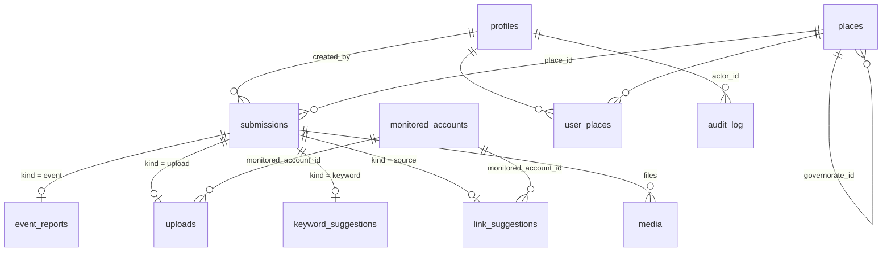

# Database schema

> **Status: planned, not built.** The field app is currently a browser-only demo. It saves each
> submission to `localStorage` (key `hatewatch_field_submissions`) and sends nothing to a server.
> This document is the Postgres (Supabase) schema a backend should use. The field names are the same
> ones the app already produces (see `saveSubmission()` in `app.js`) and the ones in the dashboard's
> data contract (`docs/CONTRACT.md` in [zaynab79i/hatewatch](https://github.com/zaynab79i/hatewatch)).

## Overview

Every field report is one row in **`submissions`**, which holds the columns shared by all kinds.
The details for each kind go in a matching 1-to-1 table: `event_reports`, `uploads`,
`keyword_suggestions` or `link_suggestions`. Files go in `media`. Accounts and channels that have
been reported go in `monitored_accounts`, which is the watchlist.



## Tables

### `profiles`: one row per person who can log in
| column | type | notes |
|---|---|---|
| `id` | uuid, PK | same id as the Supabase `auth.users` row |
| `full_name` | text | |
| `role` | enum `field_staff` \| `manager` \| `admin` | |
| `preferred_language` | enum `en` \| `ar` | |
| `is_active` | boolean, default `true` | set to false instead of deleting |
| `created_at` | timestamptz | |

### `places`: the gazetteer (a copy of `data/places.csv`)
| column | type | notes |
|---|---|---|
| `place_id` | text, PK | slug, e.g. `homs`, `jableh` |
| `name_ar`, `name_en` | text | |
| `level` | enum `governorate` \| `district` | |
| `governorate_id` | text, FK → `places.place_id` | points to itself for a governorate |
| `lat`, `lon` | numeric | centroid, for the map |

### `user_places`: which places a field worker covers (optional)
| column | type | notes |
|---|---|---|
| `user_id` | uuid, FK → `profiles.id` | PK is (`user_id`, `place_id`) |
| `place_id` | text, FK → `places.place_id` | |

### `submissions`: shared columns for every field report
| column | type | notes |
|---|---|---|
| `id` | uuid, PK | **generated on the phone**, so a retried upload can't create a duplicate |
| `kind` | enum `event` \| `upload` \| `keyword` \| `source` | picks the detail table |
| `status` | enum `draft` \| `submitted` \| `reviewed` | field staff create `submitted`; a manager sets `reviewed` |
| `place_id` | text, FK → `places.place_id`, not null | |
| `level` | enum `yellow` \| `orange` \| `red`, nullable | Watch / Warning / Urgent, same as the dashboard. **Field staff never set this**; it's set by the system or a manager. |
| `created_by` | uuid, FK → `profiles.id` | |
| `created_at`, `updated_at` | timestamptz | |
| `reviewed_by` | uuid, FK → `profiles.id`, nullable | |
| `reviewed_at` | timestamptz, nullable | |
| `manager_note` | text, nullable | only managers can see this |

Indexes: (`place_id`, `created_at`), (`kind`, `status`), (`created_by`, `created_at`).

### `event_reports`: detail for `kind = event` (maps to `events.csv`)
| column | type | notes |
|---|---|---|
| `submission_id` | uuid, PK, FK → `submissions.id` | |
| `type` | enum `clashes` \| `killing` \| `massacre` \| `bombing` \| `arrest` \| `other` | same values as `events.csv` `type` |
| `type_other` | text, nullable | filled in only when `type = other` |
| `description` | text, not null | "What happened?" |
| `is_ongoing` | boolean | |
| `occurred_at` | timestamptz | the app sends local `datetime` + `date` |
| `neighbourhood` | text, nullable | neighbourhood or landmark, typed by hand |
| `location_shared` | boolean | true only if the worker ticked "Share my exact location" |
| `lat`, `lon` | numeric, nullable | **store only if `location_shared` is true** |
| `confirmed` | boolean, default `false` | a manager sets it to true; only confirmed events are exported to `events.csv` |
| `title_en`, `title_ar` | text, nullable | a manager writes these on confirming, for `events.csv` |
| `source_url` | text, nullable | for `events.csv` |

### `uploads`: detail for `kind = upload` (the "Upload file" screen)
| column | type | notes |
|---|---|---|
| `submission_id` | uuid, PK, FK → `submissions.id` | |
| `platform` | enum, see [Platforms](#platforms) | `own_recording` means the worker took it themselves |
| `account_name` | text, nullable | empty when `platform = own_recording` |
| `handle` | text, nullable | empty when `platform = own_recording` |
| `message_text` | text, nullable | "What does the message say?" or "What does it show?" |
| `category` | enum, see [Categories](#categories) | |
| `note` | text, nullable | |
| `add_to_watchlist` | boolean | what the worker asked for; the manager decides |
| `monitored_account_id` | uuid, FK → `monitored_accounts.id`, nullable | set when the account matches, or is added to, the watchlist |

### `keyword_suggestions`: detail for `kind = keyword` (maps to `lexicon.csv`)
| column | type | notes |
|---|---|---|
| `submission_id` | uuid, PK, FK → `submissions.id` | |
| `term` | text, not null | |
| `variants` | text, nullable | other spellings as typed; split on `\|` or `,` when exported |
| `language` | enum `ar` \| `arabizi` \| `en` \| `ku` | |
| `meaning` | text, nullable | what it means and who it targets |
| `category` | enum, see [Categories](#categories) | |
| `approval` | enum `pending` \| `approved` \| `rejected`, default `pending` | the app sends this as `fields.status`; exported as `lexicon.csv` `status` |
| `term_id` | text, nullable | the `lexicon.csv` id, given when a manager approves it |
| `family`, `target_group`, `points` | nullable | a manager fills these in on approval (see CONTRACT §2) |

### `link_suggestions`: detail for `kind = source` (maps to `sources.csv`)
| column | type | notes |
|---|---|---|
| `submission_id` | uuid, PK, FK → `submissions.id` | |
| `url_or_handle` | text, not null | |
| `name` | text, nullable | |
| `type` | enum, see [Platforms](#platforms) | detected from the URL by the app (`news` = any other website) |
| `category` | enum, see [Categories](#categories) | |
| `notes` | text, nullable | |
| `add_to_watchlist` | boolean | |
| `approval` | enum `pending` \| `approved` \| `rejected`, default `pending` | exported as `sources.csv` `status` (`approved` → `active`) |
| `monitored_account_id` | uuid, FK → `monitored_accounts.id`, nullable | |

### `media`: files attached to a submission
| column | type | notes |
|---|---|---|
| `id` | uuid, PK | |
| `submission_id` | uuid, FK → `submissions.id` | uploads can have many; event reports can have photos |
| `type` | enum `image` \| `video` \| `file` | `file` = anything that can't be previewed (PDF, audio, documents) |
| `mime` | text | e.g. `application/pdf`, or `unknown` |
| `size_kb` | integer | |
| `storage_path` | text | path in the **private** bucket; never exposed, use signed URLs |
| `sha256` | text | spots duplicate uploads |
| `created_at` | timestamptz | |

Images should be re-encoded on the server to strip EXIF/GPS metadata before they're stored.

### `monitored_accounts`: the watchlist
| column | type | notes |
|---|---|---|
| `id` | uuid, PK | |
| `platform` | enum, see [Platforms](#platforms) | |
| `account_name` | text | |
| `handle` | text, nullable | |
| `normalized_handle` | text | lower-case with no `@`; **UNIQUE (`platform`, `normalized_handle`)** |
| `url` | text, nullable | |
| `place_id` | text, FK → `places.place_id`, nullable | main place it is about |
| `watchlist_status` | enum `suggested` \| `watching` \| `archived` | worker ticks the box → `suggested`; a manager sets `watching` |
| `first_seen_at` | timestamptz | |
| `first_seen_by` | uuid, FK → `profiles.id` | |

### `audit_log`: who created or changed what
| column | type | notes |
|---|---|---|
| `id` | bigserial, PK | |
| `actor_id` | uuid, FK → `profiles.id` | |
| `action` | enum `insert` \| `update` \| `delete` | |
| `table_name` | text | |
| `record_id` | text | |
| `changes` | jsonb | the fields that changed, before and after |
| `created_at` | timestamptz | |

Write this with **database triggers** on every table above, so app code can't skip it.

## Access rules (row-level security)

| role | can read | can write |
|---|---|---|
| `field_staff` | their own `submissions`, their detail rows and their `media`; `places`; `monitored_accounts` name, handle, platform and status only (to avoid duplicates) | insert their own submissions; edit them only while `status = draft` |
| `manager` | everything except `audit_log` | `status`, `level`, `manager_note`, `confirmed`, `approval`, `watchlist_status` and the manager-only fields |
| `admin` | everything, including `audit_log` | everything, plus `profiles` |

## Enumerations

These lists are defined in `data.js`. If a list changes there, change the matching enum here too.

### Event types
`clashes`, `killing`, `massacre`, `bombing`, `arrest`, `other`

### Levels
`yellow` (Watch), `orange` (Warning), `red` (Urgent)

### Categories
Same as `lexicon.csv` `category`: `political_label`, `insult`, `captivity`, `violence`, `expulsion`,
`dehumanizing_slur`, `counter_speech`

### Platforms
`instagram`, `telegram`, `whatsapp`, `facebook`, `x`, `tiktok`, `news`, `other`, `own_recording`

### Keyword languages
`ar`, `arabizi`, `en`, `ku`

## How the demo's saved record maps to these tables

The demo saves this shape. A backend should accept it as-is at `POST /api/v1/submissions`
(see `docs/API.md`):

```json
{
  "id": "0b6f1c1e-6a51-4c52-9d0e-2b7f7f1f2a10",
  "kind": "event",
  "status": "submitted",
  "place_id": "jableh",
  "level": null,
  "created_at": "2026-09-27T09:12:00.000Z",
  "created_by": "demo_field_staff",
  "fields": { "type": "other", "type_other": "Kidnapping", "description": "…", "…": "…" }
}
```

The top-level keys go into `submissions`. `fields` goes into the detail table for that `kind`, and
`fields.media` becomes rows in `media`. (`created_by` will be the logged-in user's id, not a string.)
